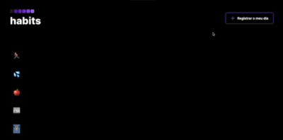

# API Pokedex

 Projeto destinado a uma aplicação que realiza uma lista de tarefas para criação de hábitos. Atividade realizada na plataforma Rocketseat, programa NLW.

 
 
 :test_tube: Proposta do projeto :nerd_face:

 <h1 align="center"> 
  
</h1>

## :gear: Funcionalidades do projeto

- `Funcionalidade 1` `Criação do dia com tarefas`: Ao clicar no botão "Registrar meu dia", será criada uma coluna com a data atual e todas as atividades.
- `Funcionalidade 2` `Deixar tarefa como "feito"`: Ao clicar no checkbox (quadrado) da tarefa, será registrado como tarefa realizada.
- `Funcionalidade 3` `Salvar evoluções`: O histórico das tarefas ficarão salvas no navegador para que o processo de criação de hábito tenha uma continuidade.

## :computer: Tecnologias usadas

- ``HTML5``
- ``CSS3``
- ``VanillaJS``

## :open_file_folder: O que acha de acessar o projeto? 
Você pode acessar o projeto clicando [aqui](https://oscarlojr.github.io/proj_habits/).